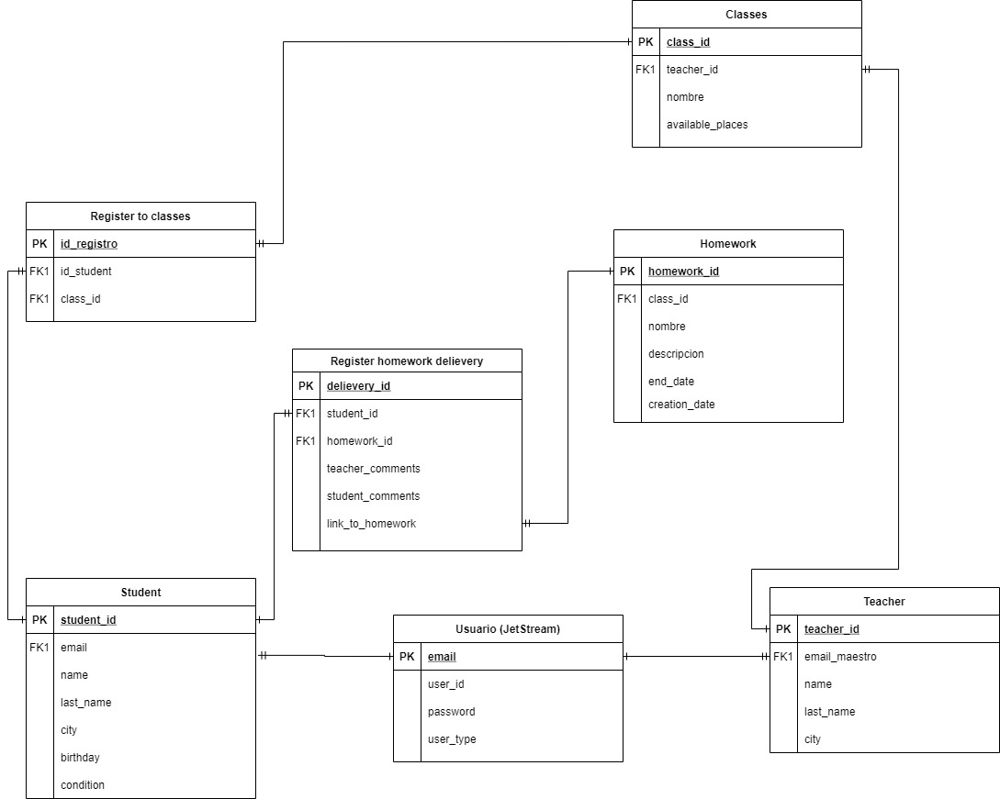

## Danza Aptitude
El desarrolo del proyecto considera tanto una landing page como un página que funja como medio para que los maestros dejen tareas para los estudiantes de Danza Aptitude y estos puedan hacer una subida de archivos.

Se tienen en cuenta varias funciones y 3 tipos de roles los cuales son lo siguientes:
- Maestros
- Estudiante
- Admin

Se explica a continuación las funciones y operaciones que puede hacer cada uno:
### Maestro
- Vista de materias en las que se encuentra asignado
- Utilizar el menú de creación de tareas, edición y descarga de ellas para revisión

### Estudiantes
- Vista de materias en las que se ha registrado
- Vista de materias en las cuales se puede registrar
- Utilizar el menú de vista de tareas que se le asignaron y puede hacer subida de archivos para completarlas
  

### Admin
- Vista de todas las materias
- Creación y edición de materias, y asignación de maestros
- Vista de todos los maestros
- Vista de todos los estudiantes
- Creación de codigos para invitación y vista de ellos, así como edición y reenvio del correo personalizado con el código de registro para que los usuarios hagan su registro

Se desarrolló una base de datos que se basa en el siguiente diagrama:

## Integrantes

- José María Dávalos
- José Emanuel Santa
- Uriel Alejandro Gutierrez

Se considera un equipo de 3 integrantes, ya que por el tiempo establecido se complicó un poco la codificación del proyecto; por lo que se busco aprovechar lo que cada integrante había desarrollado previamente y se complementó el proyecto con un diseño de interfaz adecuado.

## Instrucciones de instalación

Hacemos un clone al repositorio del proyecto Danza Aptitude
~~~
git clone https://github.com/Chema-a/Programacion-para-Internet.git
~~~
Los archivos .env y la carpeta /vendor no aparecerán

Nos dirigimos a nuestra terminal y nos posicionamos en la carpeta donde se encuentra nuestro proyecto y ejecutamos.
~~~
cd Programacion-para-internet
composer install
~~~

Esto instalará todas las dependencias y requerimientos del proyecto, y faltará el archivo .env

Desde terminal hacemos una copia del archivo .env.example

~~~
cp .env.example .env
~~~

Se creara archivo .env sin APP-KEY que se tendrá que generar

Para generarlo utilizaremos el codigo
~~~
php artisan key:generate
~~~

Una vez generado ya podemos modificar los datos de entorno de .env para poder trabajar, primeramente se especifican los pasos necesarios para hacer el testeo de envió de los correos de invitación y la verificación del correo.

Es necesario que se ingrese a la respectiva plataforma de [Mailtrap](mailtrap.io), una vez registrato y logeado, dar clic a Inboxes y a "My Inbox". 

Después en *Integrations* buscar la opción para Laravel 7+ y reemplazar la información que tiene el archivo .env con esta nueva información personalizada que aparecerá, añadiendo en la parte de `MAIL_FROM_ADDRESS=` un correo para hacer las pruebas (se puede inventar).
~~~
Lo siguiente será verificar los datos de la base de datos en el mismo archivo. Dentro del archivo se encontrarán los siguientes campos:
DB_CONNECTION=mysql
DB_HOST=127.0.0.1
DB_PORT=3306
DB_DATABASE=proyecto1
DB_USERNAME=root
DB_PASSWORD=
~~~
Se debe de corroborar que la información en estos campos coincida con la base de datos que se tenga (por lo general esto viene si se instaló laragon).
Se ingresa la respectiva contraseña y usuario de la base de datos, y se pone dentro del campo correspondiente DB_DATABASE=proyecto1

Ya tenemos nuestra aplicación instalada, ahora ejecutaremos nuestros seeders y migraciones.

~~~
Dentro del archivo .env se verifica que estén los siguientes datos correctos.

DB_CONNECTION=mysql
DB_HOST=127.0.0.1
DB_PORT=3306
DB_DATABASE=proyecto1 -> Se tiene que crear una base de datos con este nombre
DB_USERNAME=root
DB_PASSWORD= -> Poner password de base de dato

Se crea la base de datos. 
nota: se puede crear una base de datos desde consola de Laragon (implementado en este protecto) ingresando a mysql: 
~~~
mysql -uroot password
CREATE DATABASE proyecto1;
~~~
Se hace la migración
~~~
php artisan migrate --seed
~~~
Despues vamos a configurar la información de la base de datos en el *.env*

A continuación se especifican 3 tipos de cuentas creadas con los Seeders para que pueda ingresar y revisar las funciones de cada tipo de usuario:

#### Admin
Correo: admin9031@gmail.com

Contraseña: password

#### Maestro
Correo: test2031@gmail.com

Contraseña: password

#### Maestro
Correo: test5031@gmail.com

Contraseña: password

Como dato muy **IMPORTANTE**, es necesario que primero desde la cuenta del administrador se **envíe un código de verificación** al correo que se desee dar de alta en el sistema para poder guardarlo exitosamente, de lo contrario, si un estudiante intentara crear una cuenta sin un código, so se podría continuar con la operación.

